# PROSES / LANGKAH-LANGKAH PRAKTIKUM 4

## Latihan 1
### Menemukan jumlah terbesar dari dua variabel
1. masukan A = int(input("masukan bilangan 1:"))
2. kemudian masukan if lalu tambahkan a > b: lalu lakukan perintah ("bilangan terbesar").
3. selanjutnya tambahkan else untuk menentukan mana yg lebih besar antara a dan b.
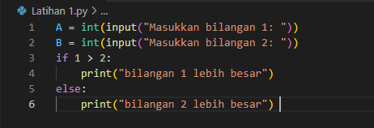

4. setelah itu running
5. lalu masukan nilai yang diinginkan.
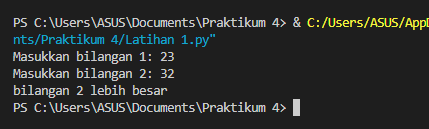

## Latihan 2
### Mencari nilai terbesar dari tiga buah variabel
1. masukan inputan seperti gambar dibawah ini.
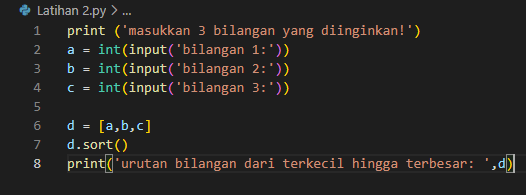

3. setelah itu running dan ini hasilnya
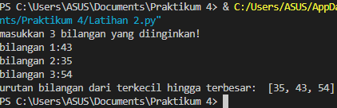

## latihan 3
### Mengurutkan angka
1. input kode for i range (0,10)
2. lalu gabungkan dengan i+j
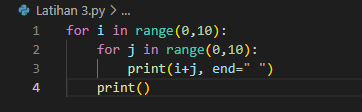

4. kemudian running untuk menghasilkan gambar dibawah ini
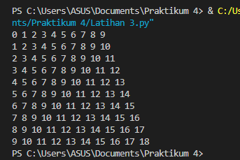

## Latihan 4
### mencari nilai dan data
1. input kode seperti gambar dibawah ini
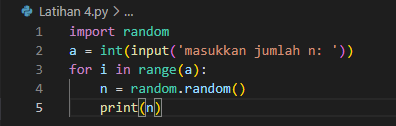

2. lalu tekan running, setelah itu masukan nilai n dengan angka yang diinginkan dan ini hasilnya
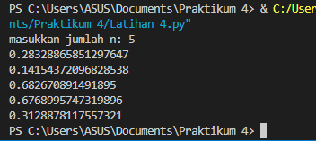

## Latihan 5
### Mencari bilangan terbesar
1. masukan a,b,c sebagai perintah inputan, kemudian tambahkan if menandakan a lebih besar dari c.
2. lalu tekan titik dua makan akan seperti ini if a > c: lakukan juga hal yang sama pada y dan z.
3. kemudian masukan bilangan terbesar lalu tambahkan elif dan else sebagai penambah aksi sebagai penentu a lebih besar dari c dan b lebih besar dari c. maka kodingan setelah dirunningnya seperti ini.
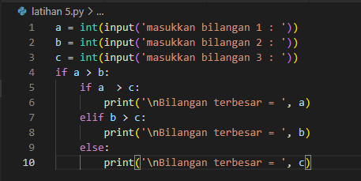

4. setelah melakukan perintah diatas masukan bilangan terbesar hingga terkecil maka akan muncul hasil yang terbesar.
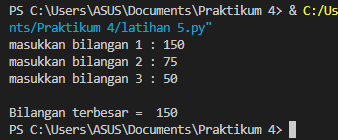

## Latihan 6
### mencari nilai n yang terbesar jumlah-nya
1. masukan max = 0. fungsinya adalah untuk mengetahui nilai terbesarnya.
2. kemudian tambahkan perintah while True: 
3. setelah itu masuk\kan x=int(input("Masukkan bilangan"))
4. lalu if max <x: pastikan sejajar dengan x
5. masukan perintah max = x
6. masukan perintah if x==0:
7. lalu tekan enter dan ketik break
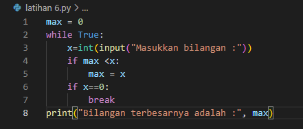

8. running file dan masukan nilai
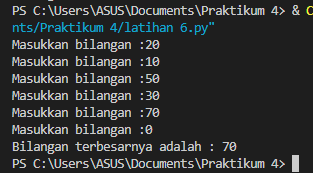

## Latihan 7
### Total laba bulan 1 sampai 8
1. masukan nilai a = 100000000
2. masukan perintah for x in range (1,9)
3. supaya ada 9 buah masukan if seperti gambar dibawah ini kemudia print total laba
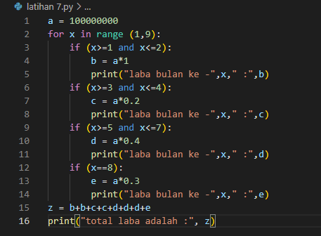

4. maka hasilnya akan keluar seperti gambar running dibawah ini.
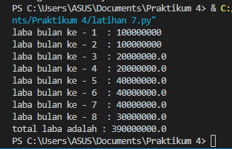
